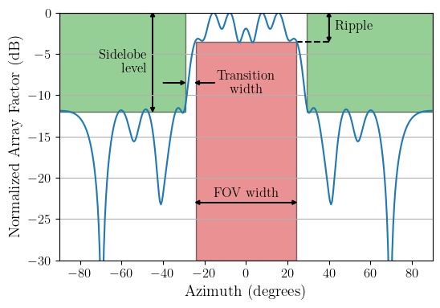

# genetic-array

This is a simple package for computing wide beam patterns for SuperDARN arrays.

## Contents

* `requirements.txt`: Use this to install the necessary deps with `pip install -r requirements.txt`
* `batch_genetic_solver.py`: This is the main script to use for computing the necessary antenna phases for generating a wide beam pattern. Run with the `-h` flag to see the usage.
* `genetic_solver.py`: This contains the solver class which is used under the hood of `batch_genetic_solver.py`. 
* `array_factor.py`: This is a bit of a hodge-podge file containing some utility functions for computing far-field array factors, and numerous other things.
* `plotting.py`: Utility functions and parameters for plotting.

## Optimization

The goal of the optimization is to find the far-field radiation pattern of the array that fits the most stringent criteria.
The figure below outlines the criteria, namely **passband ripple**, **sidelobe level**, **field of view (FOV) width**, and **transition width**.
`batch_genetic_solver.py` will iterate through various sidelobe levels and passband ripples, generating the best possible
far-field patterns for each combination. A `.png` plot is created for each combination, with the results from each trial run displayed.
Note that it may not be possible to perfectly satisfy the criteria. The results are stored in a file `results.hdf5` in the specified directory. 
The top-level groups for this file are the frequencies in kHz that have been optimized for. Inside each group, there are four datasets: 

* **scores**: The score that each solution received, with a lower score being better. Score is related to the area of the far-field pattern within
the *forbidden* regions. This will be an array of shape `[num_combos]`, where `num_combos` is the number of passband ripple and sidelobe-level combos.
* **phases**: The relative phase of each antenna, in degrees. The shape of this array is `[num_combos, num_antennas]`.
* **array_factor**: The far-field directivity of the array, in dB. The shape of this array is `[num_combos, num_points]`, where `num_points` is
the number of azimuthal points set by the `--resolution` parameter when the script was invoked.
* **grid**: The azimuthal grid accompanying **array_factor**, with shape `[num_points]`.

