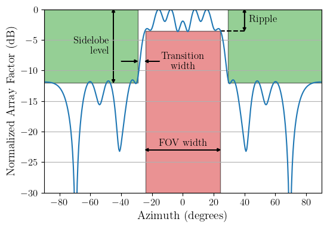

# genetic-array

This is a simple package for computing wide beam patterns for SuperDARN arrays.

## Contents

* `requirements.txt`: Use this to install the necessary deps with `pip install -r requirements.txt`
* `beam_corrections.py`: This script is used to find the necessary receiver beam directions to correct combined tx/rx beam azimuthal discrepancies when transmitting a wide beam.
* `batch_genetic_solver.py`: This is the main script to use for computing the necessary antenna phases for generating a wide beam pattern. Run with the `-h` flag to see the usage.
* `genetic_solver.py`: This contains the solver class which is used under the hood of `batch_genetic_solver.py`. 
* `array_factor.py`: This is a bit of a hodge-podge file containing some utility functions for computing far-field array factors, and numerous other things.
* `plotting.py`: Utility functions and parameters for plotting.

## Optimization

The goal of the optimization is to find the far-field radiation pattern of the array that fits the most stringent criteria.
The figure below outlines the criteria, namely **passband ripple**, **sidelobe level**, **field of view (FOV) width**, and **transition width**.
`batch_genetic_solver.py` will iterate through various sidelobe levels and passband ripples, generating the best possible
far-field patterns for each combination. A `.png` plot is created for each combination, with the results from each trial run displayed.
Note that it may not be possible to perfectly satisfy the criteria. The results are stored in a file `results.hdf5` in the specified directory. 
The top-level groups for this file are the frequencies in kHz that have been optimized for. Inside each group, there are four datasets: 

* **scores**: The score that each solution received, with a lower score being better. Score is related to the area of the far-field pattern within
the *forbidden* regions. This will be an array of shape `[num_combos]`, where `num_combos` is the number of passband ripple and sidelobe-level combos.
* **phases**: The relative phase of each antenna, in degrees. The shape of this array is `[num_combos, num_antennas]`.
* **array_factor**: The far-field directivity of the array, in dB. The shape of this array is `[num_combos, num_points]`, where `num_points` is
the number of azimuthal points set by the `--resolution` parameter when the script was invoked.
* **grid**: The azimuthal grid accompanying **array_factor**, with shape `[num_points]`.

## Workflow for generating a wide-beam configuration

The workflow to generate a new wide-beam pattern will go something like this:
1. Get data for the antenna radiation pattern from NEC (I've included a file in the repo with this data for 12 MHz, called `antenna_factor_12000khz.npz`)
2. Run the script `batch_genetic_solver.py` with the arguments for your desired wide-beam configuration 
   (I've tried it out with `python3 batch_genetic_solver.py --spacing 12.8016 --left-bound=-40 --right-bound=40 --antenna-pattern antenna_factor_12000khz.npz wallops/ 12000` 
   to generate a beam that covers an 80 degree FOV for your antenna spacing at 12000 kHz). This script will generate plots 
   of radiation patterns for different scoring criteria in a folder (wallops/ when I ran it), plus an HDF5 file with the results for the best configurations.
3. Choose your favourite configurations, and copy the relative phases for each antenna into `beam_corrections.py`'s 
   `cached_weights` function, for the frequency you optimized for. I've got an example in there already for 12 MHz, it 
   requires the relative phases in degrees for the first half of the antennas (the phases are mirrored, so only half are needed)
4. Run `beam_corrections.py`, which will make two plots:
   * The transmit beam, main array directivity, interferometer array directivity, and the product of the main and interferometer 
     array directivities, all for a single "nominal" receiver beam direction. Essentially, this is just giving you an idea 
     that the peak of each array directivity is not in the direction of the nominal beam
   * The actual peak beam direction as a function of the nominal beam direction, to show you how far off of nominal the configuration is for different beam directions.
   * The script also spits out the receiver beam directions that should be used in order to produce an actual beam in the 
     desired direction for Wallops beams, assuming 24 beams each 3.24 degrees apart. There are two results, one for the 
     main array and another for the cross-correlations. These results will later need to be manually copied into 
     borealis_postprocessors in order to properly process the antennas_iq data into rawacf data.